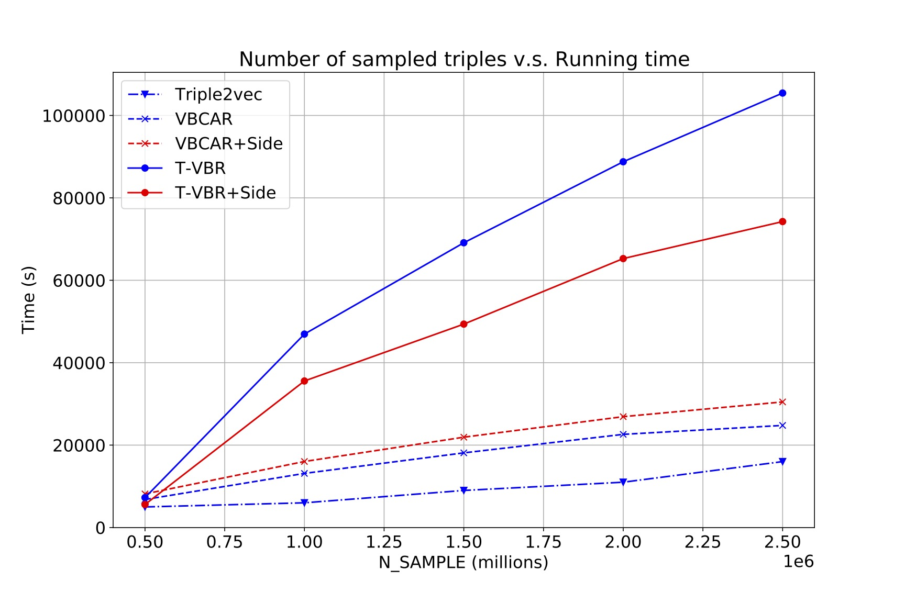

# Learning Temporal Representation for Grocery Recommendation

>This is our Pytorch implementation for the paper:
>**Anonymous Author(s), Learning Temporal Representation for Grocery Recommendation, 2020**

### Response to Reviewer #1


#### Time analysis
- **Running time over different number of sampled triples**
<a href="url">

#### Performance comparison of T-VBR over different item features
We have explored four different types of item features and their combinations to determine the best feature for items.
- **Item Key (Key)**: This is randomly generated keys for items as the identical codes.
- **One-hot (One)**: The category feature of item can be directly repesented as the one-hot encoding. The textual information of items, such as product description, can be also repesentated as the one-hot encoding based on the frequent words.
- **Word2vec (W2C)**: We use the Google pre-trained [Word2vec model](http://code.google.com/archive/p/Word2vec/) to obtain embeddings for all the words appearing in the item descriptions. We construct the product description embedding by simply averaging the word embedding vectors along each dimension for all the words in the description.
- **BERT**: We also use the Bidirectional Encoder Representations from Transformers (BERT), a popular pre-trained language model for encoding words and sentences into embeddings. In particular, we use DistilBert from HuggingFace, which is a smaller and faster architecture based on BERT.

<a href="url"></a>

#### Performance comparison over different feature on Dunnhumby dataset
<a href="url"></a>

#### Performance comparison over different feature on Instacart dataset
<a href="url"></a>

-----------
### Response to Reviewer #3

#### Overall performance on top-k item recommendation (k={ 5, 10 }). The red rows are the additional result of the HIRE model. The detailed implementation of the HIRE model can be found in [HIRE](./HIRE/train_HIRE.py)
<a href="url"></a>

-----------
## Introduction

This paper focuses on the recommendation task in the grocery shopping scenario, where users purchase multiple products in sequential baskets. It is commonly acknowledged that both users' interests and products' popularities vary over time. However, few prior grocery recommendation methods account for such temporal patterns, instead, representing each user and product via a static low dimensional vector. In contrast, we propose a new model: Temporal Variational Bayesian Representation (T-VBR) for grocery recommendation, which is able to encode temporal patterns to improve effectiveness. T-VBR is designed under the temporal variational Bayesian framework, and it learns the temporal Gaussian representations for users and items by encoding information from: 1) the basket context; 2) item side information; and 3) the temporal context from past user-item interactions. T-VBR is trained using sampled triples of users with two items bought together in baskets during different time windows, via a Bayesian Skip-gram model based on a temporal variational auto-encoder. Experiments conducted on four public grocery shopping datasets show that our proposed T-VBR model can significantly outperform the existing state-of-the-art grocery recommendation methods, and can learn more expressive representations that effectively capture the temporal information.

## Environment Requirement

The code has been tested running under Python 3.7.5 and Pytorch 1.4.0. The required packages can be found at requirements.txt

## Usage instruction


To run our models as well as the baselines, you can go to the "./example" floder, run the python code on terminal by:

```shell
    python ./train_tvbr.py --dataset dunnhumby --n_sample 1000000 --emb_dim 64
```
## All the default paramter settings are in "./configs" 
## You can also specify you customized arguments by command line:

--dataset: Specify the datasets.

--percent: Percentage of the dataset. Only used in Instacart dataset.

--n_sample: Number of sampled triples.

--emb_dim: Dimension of embeddings 

--lr: Inital learning rate

--alpha: Parameter for the KL terms. We use the annealing technique to decay the impact of KL terms.

--time_step: Time step for spliting the sequential baskets

--max_epoch: Training epoches. 

--item_fea_type: Item feature type. Can be 'random' 'word2vec' 'bert' or their combinations.
